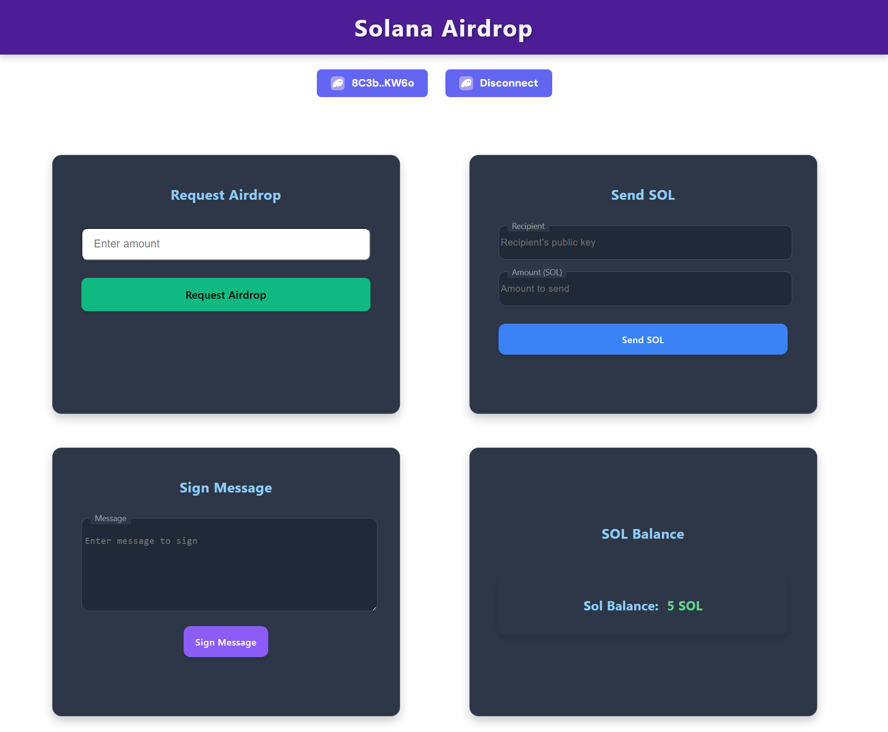

# Solana Wallet Adapter

A modern React application that demonstrates integration with the Solana blockchain using the Solana Wallet Adapter. This project provides a simple interface for connecting to Solana wallets, viewing balances, requesting airdrops, sending SOL, and signing messages.

## Features

- **Wallet Connection**: Connect to various Solana wallets using the Wallet Adapter
- **Balance Checking**: View your SOL balance in real-time
- **Airdrop Functionality**: Request SOL airdrops on devnet for testing
- **Token Transfer**: Send SOL to other wallet addresses
- **Message Signing**: Sign messages using your Solana wallet

## Technologies Used

- React 18
- Vite
- Solana Web3.js
- Solana Wallet Adapter
- Noble Curves (for cryptographic operations)

## Screenshot



## Getting Started

### Prerequisites

- Node.js (v16 or higher)
- npm or yarn
- A Solana wallet (Phantom, Solflare, etc.)

### Installation

1. Clone the repository:
```bash
git clone https://github.com/your-username/wallet-adapter.git
cd wallet-adapter
```

2. Install dependencies:
```bash
npm install
# or
yarn
```
3. Start the development server:
```bash
npm run dev
# or
yarn dev
```

4. Open your browser and navigate to `http://localhost:5173`

## Usage

### Connecting a Wallet

1. Click the "Select Wallet" button
2. Choose your preferred wallet from the modal
3. Approve the connection request in your wallet

### Checking Balance

Once connected, your SOL balance will automatically display on the screen.

### Requesting an Airdrop

1. Enter the amount of SOL you want to request
2. Click "Request Airdrop"
3. Wait for the transaction to complete

### Sending SOL

1. Enter the recipient's public key
2. Enter the amount of SOL to send
3. Click "Send Tokens"
4. Approve the transaction in your wallet

### Signing Messages

1. Enter a message in the input field
2. Click "Sign Message"
3. Approve the signing request in your wallet

## Building for Production

To build the application for production:

```bash
npm run build
# or
yarn build
```

The built files will be in the `dist` directory.

## Development

### Available Scripts

- `npm run dev` - Start the development server
- `npm run build` - Build for production
- `npm run lint` - Run ESLint
- `npm run preview` - Preview the production build locally

## License

[MIT](LICENSE)

## Acknowledgements

- [Solana](https://solana.com/)
- [Solana Wallet Adapter](https://github.com/solana-labs/wallet-adapter)
- [Vite](https://vitejs.dev/)
- [React](https://reactjs.org/)
```

This README provides a comprehensive overview of your project, including its features, technologies used, setup instructions, usage guidelines, and development information. Feel free to customize it further to better match your project's specific details or requirements.
